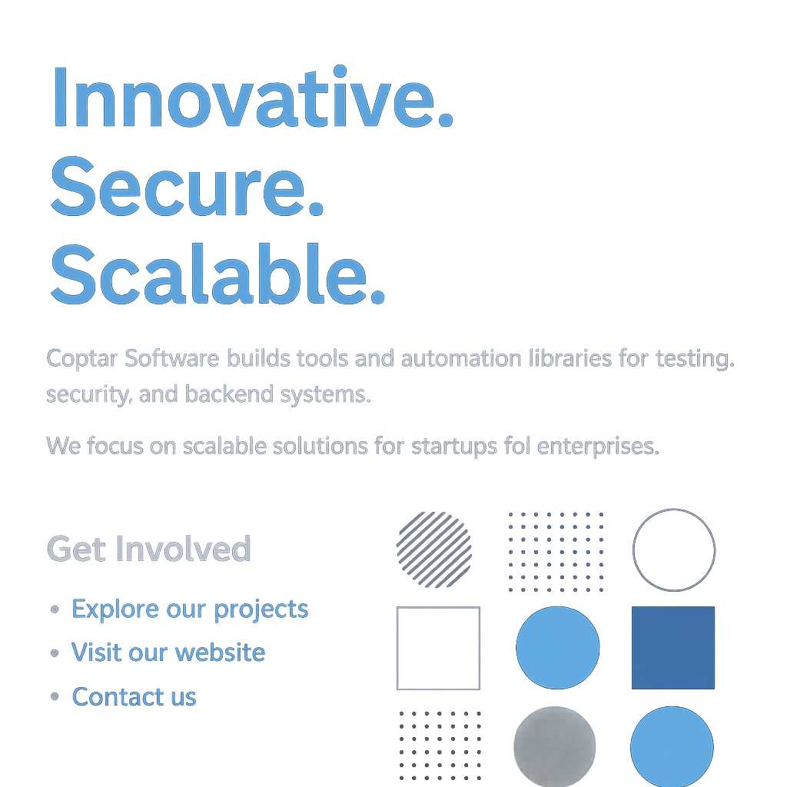

# 

---

CoptarSoftware is a dedicated space for creating, refining, and showcasing software projects.  
Every project here focuses on clean architecture, performance, and practical value – from small tools to complete systems.

---

## What You’ll Find Here

- **Modern tools and libraries** – utilities for testing, automation, and integration.
- **Full-stack projects** – prototypes and production-ready solutions.
- **Experimentation and R&D** – exploring new tech and refining best practices.

---

## Focus Areas

- **Automation Frameworks:**  
  - **UI Testing Framework** — a generic framework for UI test automation based on Selenium  
  - **Security Testing Framework** — a security test automation framework that integrates multiple tools  
- **Quality & Security Practices:** automated testing, secure coding practices  

---

## Featured Projects

Soon to be released – libraries, automation tools, and experimental builds.

---

## Connect

For collaborations or inquiries, feel free to open an issue or check updates here.

---

  © 2025 Coptar – Building, experimenting, delivering.

